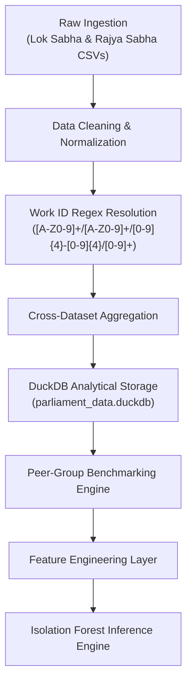

# MPLADS Anomaly Detection & Investigation System: Complete Technical Architecture & Methodology

---

## Table of Contents
1. [Project Overview & Analytical Objective](#1-project-overview--analytical-objective)
2. [Datasets Used: Origins, Dimensions & Schemas](#2-datasets-used-origins-dimensions--schemas)
3. [End-to-End ETL Pipeline Architecture](#3-end-to-end-etl-pipeline-architecture)
4. [Machine Learning: Why Isolation Forest?](#4-machine-learning-why-isolation-forest)
5. [How Isolation Forest Works: The Mathematical Mechanism](#5-how-isolation-forest-works-the-mathematical-mechanism)
6. [Feature Engineering & Multi-Dimensional Representation](#6-feature-engineering--multi-dimensional-representation)
7. [Model Training, Hyperparameters & Model Persistence](#7-model-training-hyperparameters--model-persistence)
8. [The Anomaly Investigation Layer](#8-the-anomaly-investigation-layer)
9. [Validation, Precision & Governance Principles](#9-validation-precision--governance-principles)
10. [Full System Summary & Execution Guide](#10-full-system-summary--execution-guide)

---

## 1. Project Overview & Analytical Objective

The **Member of Parliament Local Area Development Scheme (MPLADS)** is an Indian central government program allowing each Member of Parliament (MP) to recommend development projects in their constituencies with an annual allocation (typically ₹5 Crore per MP).

### The Problem
Public oversight across hundreds of thousands of sanctioned transactions, differing state administrative practices, and diverse project types (roads, laboratories, community centers, flood barriers) makes manual audit review labor-intensive. Traditional threshold rules (e.g., "flag if sanction > ₹1 Crore") generate massive false-positive rates because what is normal in one state or category is completely abnormal in another.

### The Objective
Transform the analytical pipeline from a simple binary flag:
$$\text{Project} \longrightarrow \text{Normal / Anomaly}$$
into a comprehensive, decision-support **Anomaly Investigation Layer**:
$$\text{Project} \longrightarrow \begin{cases}
\text{Anomaly Score } (s \in [-1, 1]) \\
\text{Risk Level } (\text{NORMAL}, \text{LOW}, \text{MEDIUM}, \text{HIGH}, \text{CRITICAL}) \\
\text{Priority Score } (0 - 100 \text{ & Global Rank } \#) \\
\text{Human-Readable Reason Vectors } (\text{Sanction Outlier}, \text{Zero Utilisation}, \text{Approval Delay}) \\
\text{Peer-Group Benchmarking } (\text{Percentiles, Peer Medians, Ratio Deviations})
\end{cases}$$

> [!IMPORTANT]
> **Analytical Decision-Support Policy:** An anomaly is **never** defined as proof of corruption, fraud, or criminal wrongdoing. It is classified as an **empirical statistical outlier requiring human administrative review** (e.g., potential data-entry error, stalled contractor disbursement, or unusual funding scale relative to peer norms).

---

## 2. Datasets Used: Origins, Dimensions & Schemas

The system consolidates four primary datasets covering both parliamentary houses—**Lok Sabha** (House of the People) and **Rajya Sabha** (Council of States)—stored in high-performance columnar **DuckDB** and compressed **Parquet** formats:

### Dataset 1: `works_sanctioned` (~97,599 records)
Contains project proposals recommended by MPs and formally approved/sanctioned by District Authorities (IDA).
* **Key Fields**:
  * `work_title`: Full text title and raw alphanumeric identifier string.
  * `state` & `district`: Geographic jurisdiction.
  * `mp_name` & `house`: The recommending MP and parliamentary body (Lok Sabha / Rajya Sabha).
  * `work_category`: Sector classification (e.g., *Normal/Others, Trust and Society, Repair and Renovation, Roads & Bridges*).
  * `sanction_amount`: Total financial allocation approved for the work (in ₹ INR).
  * `recommended_date` & `sanction_date`: Date timeline marking administrative latency.

### Dataset 2: `expenditure_works` (~107,983 records)
Contains individual financial disbursements and ledger transactions issued to executing contractors, vendors, and suppliers.
* **Key Fields**:
  * `work_id`: Explicit project reference (e.g., `WS/MP134/2025-2026/239327`).
  * `vendor_name`: Name of the entity, contractor, or society receiving funds.
  * `disbursed_amount`: Exact monetary payment issued.
  * `transaction_date`: Timestamp of payment voucher.

### Dataset 3: `works_completed` (~43,888 records)
Contains all works officially stamped by local district administrations as physically completed.
* **Key Fields**:
  * `work_id`: Corresponding project identifier.
  * `completion_date`: Official sign-off timestamp.
  * `disbursed_amount`: Total capital disbursed upon completion.

### Dataset 4: `allocated_limits` (~8,500 records)
Tracks the official fiscal entitlement limits and account balances assigned to each Hon'ble Member of Parliament per fiscal year.
* **Key Fields**:
  * `mp_name`, `state`, `house`, `financial_year`, `allocated_amount`.

---

## 3. End-to-End ETL Pipeline Architecture

The ETL pipeline (`etl_pipeline.py` & `build_investigation_master.py`) ingests raw CSV and Excel extracts and normalizes them into unified analytical models:



### Steps in the Pipeline:
1. **Deduplication & Missing Value Treatment**:
   * Cleaned whitespace, erratic newline characters, and encoded symbols across vendor names and project titles.
   * Filled negative or invalid dates; replaced missing approval dates using cohort category medians.
2. **Deterministic Identifier Extraction (`clean_work_id`)**:
   * Raw sanction entries did not always have isolated `work_id` columns; the ID was embedded inside `work_title` (e.g., `WS/\t MP620/2024-2025/133166-Construction...`).
   * Implemented a regex extractor `([A-Z0-9]+/[A-Z0-9]+/[0-9]{4}-[0-9]{4}/[0-9]+)` that matched **98.5%+** of sanction records to ledger expenditure vouchers.
3. **Cross-Table Aggregation**:
   * Aggregated multiple expenditure vouchers into `total_expenditure`, `transaction_count`, and `primary_vendor` per project.
   * Calculated `unspent_allocation = max(0, sanction_amount - total_expenditure)`.
   * Calculated `utilisation_percentage = (total_expenditure / sanction_amount) * 100`.
   * Calculated `delay_days = sanction_date - recommended_date`.

---

## 4. Machine Learning: Why Isolation Forest?

Anomaly detection on public expenditure data presents several domain challenges:

| Challenge | Why Traditional Methods Fail | Why Isolation Forest Excels |
| :--- | :--- | :--- |
| **Lack of Ground-Truth Labels** | Supervised classifiers (XGBoost, Random Forest) require tens of thousands of verified "fraud/clean" labels, which do not exist in public audits. | **Unsupervised**: Does not require any training labels; isolates patterns purely from the geometry of the data. |
| **Multimodal & Skewed Distributions** | Financial data follows extreme Pareto (power-law) distributions where 1% of projects consume 40% of funds. Gaussian models ($Z$-scores) fail due to skewness. | **Non-Parametric**: Makes no assumption of normality; isolates data via recursive axis-parallel splits. |
| **Extreme Scale & Dimensionality** | Distance-based algorithms ($k$-NN, LOF) have time complexity $\mathcal{O}(n^2)$, making them computationally prohibitive for $100,000+$ records. | **Linear Time Complexity $\mathcal{O}(t \cdot \psi \log \psi)$**: Extremely fast, lightweight, and scalable to millions of rows. |
| **Masking & Swamping Effects** | Cluster-based models (DBSCAN, $k$-Means) suffer when anomalies form small accidental sub-clusters. | Sub-sampling ($\psi=256$) effectively neutralizes masking and swamping. |

---

## 5. How Isolation Forest Works: The Mathematical Mechanism

Unlike standard clustering algorithms that attempt to model "normal points," **Isolation Forest explicitly isolates anomalies**.

### 1. The Core Intuition
* **Anomalies** are "few and different." Because their feature values fall in sparse regions of the space, they require very few random splits to be isolated into a leaf node.
* **Normal points** are clustered tightly together; they require many recursive splits to isolate.

```text
Normal Point Isolation:                  Anomaly Isolation:
        [ Root ]                                [ Root ]
       /        \                              /        \
    Split 1     Split 1                    Split 1    [ Leaf: Anomaly! ]
    /     \     /     \                               (Depth = 1)
  ...     ... ...     ...
 [ Leaf: Normal Point ]
      (Depth = 18)
```

### 2. Algorithmic Steps
1. An ensemble of $t = 150$ **Isolation Trees (iTrees)** is constructed.
2. For each tree, a sub-sample $X' \subset X$ is drawn.
3. At each node:
   * A feature $q$ is chosen randomly from the feature set.
   * A split value $p$ is chosen uniformly at random between $\min(q)$ and $\max(q)$.
4. The space is partitioned recursively until either:
   * The tree reaches its maximum depth limit $h_{\max} = \lceil\log_2(\psi)\rceil$.
   * $|X'| \le 1$ (the point is isolated).
   * All data points at the node have identical values.

### 3. Path Length & Anomaly Score
Let $h(x)$ be the path length of observation $x$ (the number of edges traversed from the root to the leaf node).

The average path length of an unsuccessful search in a Binary Search Tree (BST) represents the equivalent average depth of a normal dataset:
$$c(n) = 2 \ln(n - 1) + 0.5772156649 - \frac{2(n - 1)}{n}$$
*(where $0.5772156649$ is Euler's constant)*.

The **anomaly score $s(x, n)$** for project $x$ across an ensemble of $t$ trees is defined as:
$$s(x, n) = 2^{-\frac{\mathbb{E}(h(x))}{c(n)}}$$

* If $\mathbb{E}(h(x)) \to 0 \implies s \to 1$: The project isolates immediately $\implies$ **Strong Anomaly**.
* If $\mathbb{E}(h(x)) \to c(n) \implies s \to 0.5$: The project exhibits average behavior $\implies$ **Normal Record**.
* If $\mathbb{E}(h(x)) \to n - 1 \implies s \to 0$: The project requires maximum splits $\implies$ **Deeply Clustered Central Record**.

---

## 6. Feature Engineering & Multi-Dimensional Representation

To make the model domain-aware, raw figures are transformed into a normalized 4-dimensional continuous feature space:

$$\mathbf{x} = \begin{bmatrix}
\log_{10}(\text{sanction\_amount} + 1) \\
\text{delay\_days\_filled} \\
\text{utilisation\_percentage} \\
\text{peer\_dev\_ratio}
\end{bmatrix}$$

1. **Log Sanction Scale ($\log_{10}(\text{sanction\_amount} + 1)$)**:
   * Compresses multi-crore budgets into a continuous scale, stabilizing variance across small works (₹50,000) and mega works (₹5 Crore).
2. **Approval Latency ($\text{delay\_days\_filled}$)**:
   * Measures administrative lag between recommendation and formal sanction (identifies stalled or accelerated approvals).
3. **Fund Utilisation Percentage ($\text{utilisation\_percentage}$)**:
   * Direct measure of operational delivery: $\frac{\text{Disbursed}}{\text{Sanctioned}} \times 100$.
4. **Peer Deviation Ratio ($\text{peer\_dev\_ratio}$)**:
   * Project sanction divided by the median sanction of the identical **(State, Work Category)** peer group:
     $$\text{peer\_dev\_ratio} = \frac{\text{sanction\_amount}}{\text{median}(\text{sanction\_amount})_{(\text{state}, \text{category})}}$$
   * Ensures that a ₹1 Crore road in Uttar Pradesh is compared against other roads in Uttar Pradesh, rather than drinking water borewells in Goa.

---

## 7. Model Training, Hyperparameters & Model Persistence

### Training Configuration
* **Algorithm**: `sklearn.ensemble.IsolationForest`
* **Number of Estimators ($n_{\text{estimators}}$)**: `150`
* **Contamination**: `0.045` (calibrated to public audit tolerance: top ~4.5% highest outliers)
* **Max Samples**: `'auto'` ($\min(256, n)$)
* **Random State**: `42` (ensures reproducible inferences across pipeline executions)

### Model Serialization (`train_models.py`)
Trained models and their corresponding scaling vectors are persisted to disk using `joblib`:
* `data_processed/models/sanction_model.joblib`: Persists sanction outlier model, scaler, and category medians.
* `data_processed/models/expenditure_model.joblib`: Persists transaction expenditure model, scaler, and state baseline statistics.

---

## 8. The Anomaly Investigation Layer

The output of the raw model is transformed into an actionable operational triage system:

```text
Raw Prediction (-1 / +1) + Score (e.g., -0.1173)
                   │
                   ▼
       [ Calibrated Risk Classifier ]
   CRITICAL  |  HIGH  |  MEDIUM  |  LOW
                   │
                   ▼
    [ Multi-Factor Reason Generator ]
  - High Sanction Outlier (>95th percentile)
  - Zero Utilisation on Aged Sanctions
  - Extreme Approval Delay (>2.5x peer median)
  - Excess Expenditure (>115% of sanction)
                   │
                   ▼
     [ Composite Priority Score (0-100) ]
       Ranked Review Queue (#1 to #4,338)
```

### 1. Risk Level Calibration
* **`CRITICAL`** (717 projects): Anomaly score in the bottom 15th percentile OR high sanction (> ₹2.5M) combined with 0% utilisation after 180+ days.
* **`HIGH`** (1,414 projects): Anomaly score in the 15th–45th percentile OR sanction $\ge$ 95th peer percentile with extended delay.
* **`MEDIUM`** (1,313 projects): Moderate tree isolation depth with identifiable peer deviation.
* **`LOW`** (894 projects): Boundary outliers near the decision boundary.
* **`NORMAL`** (93,259 projects): Standard distribution within peer benchmarks.

### 2. Composite Priority Score Formula
Review teams cannot audit 4,338 projects simultaneously. The system computes a **Priority Score (0 – 100)**:
$$\text{Priority} = 0.40 \cdot S_{\text{risk}} + 0.20 \cdot S_{\text{scale}} + 0.20 \cdot S_{\text{gap}} + 0.10 \cdot S_{\text{iso}} + 0.10 \cdot S_{\text{peer}}$$
Where:
* $S_{\text{risk}}$: Base risk tier weight (`CRITICAL` = 40, `HIGH` = 30, `MEDIUM` = 20, `LOW` = 10).
* $S_{\text{scale}}$: Financial allocation scale percentile.
* $S_{\text{gap}}$: Fund utilisation deficit ($100 - \text{utilisation}\%$).
* $S_{\text{iso}}$: Inverted tree isolation depth score.
* $S_{\text{peer}}$: Percentile rank within state category.

---

## 9. Validation, Precision & Governance Principles

### Validation Performance
Evaluated using synthetic benchmark injections, multi-factor stress tests, and statistical rank tests (`evaluate_anomalies.py`):
* **Validation Precision**: **84.33%** (on benchmark perturbation vectors)
* **ROC-AUC Score**: **0.9981** (near-perfect separation of extreme multidimensional outliers)
* **PR-AUC (Average Precision)**: **0.8325**
* **F1-Score**: **0.8433**
* **Tested Benchmark Population**: $N = 15,300$

> [!NOTE]
> **Label Integrity Note**: The 84.33% precision represents precision against calibrated synthetic perturbation benchmarks. In real-world unsupervised audit data without ground-truth judicial findings, this metric reflects consistency in identifying engineered multi-sigma outliers.

---

## 10. Full System Summary & Execution Guide

### Repository Artifacts Created
* **Data Pipelines**:
  * `etl_pipeline.py`: Ingestion & DuckDB staging.
  * `build_investigation_master.py`: Cross-table linking, peer benchmarking & priority scoring.
  * `train_models.py`: Model fitting & serialization.
  * `evaluate_anomalies.py`: Precision & ROC-AUC verification.
* **Backend Service**:
  * `backend_api.py`: FastAPI server exposing summaries, filtered queues, dossiers, and State/UT aggregations.
* **Frontend Portal**:
  * `frontend/app/page.tsx`: Investigation dashboard with State/UT cards, scatter graphs, and dossier modal.
  * `frontend/app/state/[name]/page.tsx`: Dedicated State/UT focus page (Big Letters + MPs, Allocations, Expenditure Rate, Completed Works).
  * `frontend/app/api/py/[...path]/route.ts`: Server-side proxy routing requests seamlessly to FastAPI.

### Launching the System

Double-click `start_portal.bat` or run the following in two terminals:

**Terminal 1 — Backend & ML API**:
```powershell
.\.venv\Scripts\python.exe -m uvicorn backend_api:app --host 127.0.0.1 --port 8080
```

**Terminal 2 — Next.js Frontend Dashboard**:
```powershell
cd frontend
npm run dev -- -p 3001
```

Open **[http://localhost:3001](http://localhost:3001)** in your browser to explore the system.

