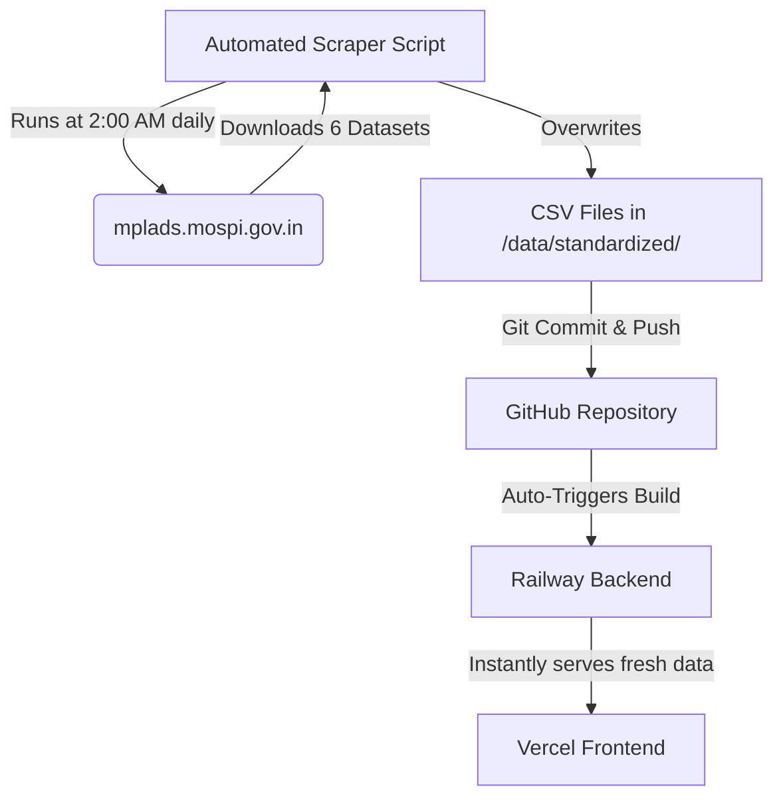

# Live Automated Scraper Plan (MOSPI Dashboard)

This plan outlines the architecture and time estimate for building an automated system to fetch data live from the government's `mplads.mospi.gov.in` dashboard.

## Time Estimate
**Estimated Time to Complete: 2 to 4 Hours**

*Why this long?* Government portals rarely provide clean "APIs". We have to reverse-engineer the website's internal network requests, bypass session timeouts, handle CSRF security tokens, and write logic to click through every single state, district, and MP to extract all 378,000+ rows of data without getting our IP address blocked.

## The Problem with "Live" Fetching
As discussed, we **cannot** fetch this data the exact second a user opens your Vercel dashboard. It would take over 10 minutes just to download all the data from the government servers, and Vercel will time out after 10 seconds. 

## The Proposed Architecture (Nightly Cron Job)

### Step-by-Step Implementation:
1. **Reverse Engineer the Dashboard**: I will analyze the HTML/JavaScript of `mplads.mospi.gov.in/digigov/dashboard.html` to find the hidden backend API endpoints it uses to populate its tables.
2. **Build the Python Scraper (`scraper.py`)**: I will write a robust Python script using `requests` and `BeautifulSoup` that iterates through the APIs, downloads the latest data, and formats it to exactly match your current 6 standardized CSV files.
3. **Automate with GitHub Actions**: I will create a `.github/workflows/scrape.yml` file. This is a free server provided by GitHub that will wake up every night, run `scraper.py`, and automatically commit the new CSV files to your repository.
4. **Deploy**: Because your backend is on Railway, the moment GitHub commits the new CSV files, Railway will automatically rebuild the backend with the fresh data!

## Open Questions
1. **Are you okay with a 2-4 hour delay while I reverse engineer the government portal?**
2. **Do you agree with the "Nightly GitHub Action" approach, which is the only way to keep your Vercel dashboard lightning fast?**

---
> [!IMPORTANT]
> **Please review this plan. If you accept the time estimate and architecture, click "Proceed" and I will begin reverse engineering the MOSPI dashboard.**
